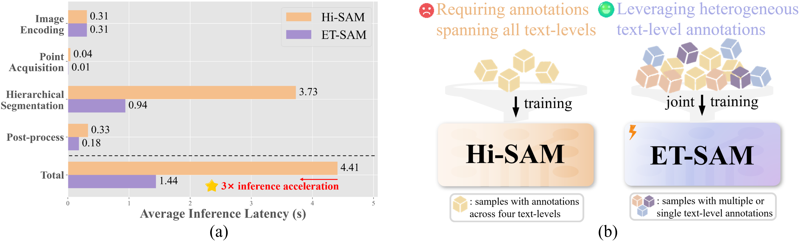
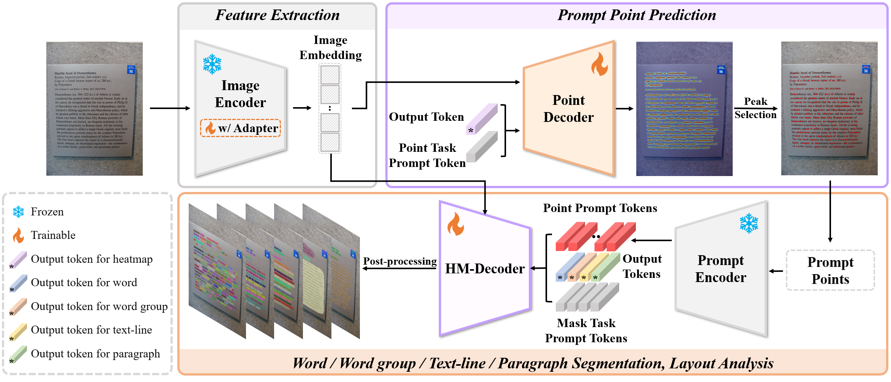

<h1 align="center">ET-SAM: Efficient Point Prompt Prediction in SAM for Unified Scene Text Detection and Layout Analysis</h1>

<p align="center">
<a href="https://arxiv.org/abs/2603.25168">
    
</a>

This is the official repository of ET-SAM, a unified framework built on SAM that improves efficiency and accuracy for scene text detection and layout analysis via a lightweight point prompt prediction mechanism and a joint training strategy for heterogeneous text annotations.

</p>
<p align="center">
    
</p>

## Overview of ET-SAM

<p align="center">
    
</p>

## Preparation
**Environment**: `Linux` `Python 3.10` `Pytorch 2.4` `CUDA 12.2`
### Install
```
conda create -n etsam python=3.10 -y 
conda activate etsam
pip install torch==2.4.1 torchvision==0.19.1 torchaudio==2.4.1 --index-url https://download.pytorch.org/whl/cu121
pip install -r requirements.txt
git clone **TODO**
cd ET-SAM
```
### Models
We provide ET-SAM checkpoints trained with the SAM ViT-L backbone, including both the jointly trained model and fine-tuned models for downstream tasks. 
All weights are available at [OneDrive](https://1drv.ms/f/c/f8f1dd7c4d15b330/IgARTBUDWf7EQZ81IuEJl720AXv8yvu1cx2Q-s3M0KOfu4k?e=VuPV2C).
These checkpoints only contain the ET-SAM components, i.e., the image encoder adapter, point decoder, and HM-Decoder. 
Therefore, the frozen ViT image encoder weights must be loaded from the original [ViT-L SAM backbone](https://dl.fbaipublicfiles.com/segment_anything/sam_vit_l_0b3195.pth).

For training ET-SAM, the isolated [mask decoder weights](https://1drv.ms/u/s!AimBgYV7JjTlgctjx03utTjx31EexA?e=HG7zZD) from the ViT-L SAM model are also required for initialization of the point decoder and HM-Decoder.

All downloaded files should be placed in the `checkpoints` directory.

### Datasets

1. Datasets Download
    
    Please obtain the following datasets from their official repositories:
    [HierText](https://github.com/google-research-datasets/hiertext), 
    [Total-Text](https://github.com/cs-chan/Total-Text-Dataset/tree/master), 
    [CTW1500](https://github.com/Yuliang-Liu/Curve-Text-Detector), 
    [ICDAR2013](https://rrc.cvc.uab.es/?ch=2),
    [ICDAR2015](https://rrc.cvc.uab.es/?ch=4), 
    [TextSeg](https://github.com/SHI-Labs/Rethinking-Text-Segmentation).
   Then organize the datasets in the following structure:
    ```
    datasets/
        HierText/
            gt/
                train.jsonl  
                val.jsonl  
                test.jsonl  
            train/  # train set images
            val/  # validation set images
            test/  # test set images
            train_heatmap/ # train set target heatmap
        TotalText/
            gt/
                test_gt/  # test set annotations
                train_gt/  #  train set annotations
            train/
            test/
            train_heatmap/
        TextSeg/
            gt/
                annotation/  # all annotations
                split.json  # dataset split
            train/  
            val/
            test/ 
        CTW1500/
            ...  # consistent with Total-Text.
        ICDAR2013/
            ...  # consistent with Total-Text.
        ICDAR2015/
            ...  # consistent with Total-Text.
    ```
2. Preprocess
    
    To train ET-SAM, the collected datasets need to be preprocessed and target heatmaps should be generated for optimizing the point decoder.
    Specifically, the preprocessing scripts under `et_sam/data/preprocess/` are used to organize and merge ground-truth annotations for each dataset, while also generating the corresponding target heatmaps.

    For example:
    ```
    python et_sam/data/preprocess/HierText_process.py --root_dir ./datasets/HierText
    ```
    These scripts merge the masks of all training images into a single `train_gt.json`, which is saved under the `gt` of each corresponding dataset. 
    In addition, they generate target heatmaps as `.npy` files in the `train_heatmap`.

## Usage
### Demo

```
python demo.py \
--test_image_dir demo_images/demo0.jpg \
--checkpoint checkpoints/joint_train.pth \
--output_dir output/demo \
--model_type vit_l --hier_det --device 0 \
--use_task_prompt --task_type 0 \
--point_batch_size 100 --point_threshold 0.6
```
- `--test_image_dir`: Path to the input image or image directory for inference.
- `--checkpoint`: Path to the pretrained model checkpoint used for initialization.
- `--output_dir`: Directory to save visualization results.
- `--model_type`: Backbone type of SAM (e.g., vit_l).
- `--hier_det`: Enable hierarchical text detection mode. If not enabled, the model will only predict heatmaps and prompt points.
- `--device`: GPU index used for inference (e.g., 0 means cuda:0).
- `--use_task_prompt`: Enable task prompt parameters.
- `--task_type`: Specifies the task type.
- `--point_batch_size`: Number of points processed per batch during inference.
- `--point_threshold`: Threshold for filtering predicted point candidates.

### Test

```
python test.py \
--test_image_dir ../datasets/HierText/test \
--checkpoint checkpoints/joint_train.pth \
--output_dir output/HierText/test \
--model_type vit_l --hier_det --device 0 \
--use_task_prompt --task_type 0 \
--point_batch_size 100 --point_threshold 0.6 \
--eval --visualize
```
- `--eval`: Enable evaluation mode, which saves predicted mask results for quantitative analysis.
- `--visualize`: Enable visualization mode, which visualizes predicted mask results for qualitative analysis.

Other parameter details of **demo** and **test** can be found in the `test.py` files.

## Train
### Joint Train

```
CUDA_VISIBLE_DEVICES=0,1,2,3 torchrun --nproc_per_node=4 joint_train.py \
--model_type vit_l --hier_det --use_task_prompt \
--epoch_num 120 --lr_drop_epoch 100 \
--output_path checkpoints/joint_train.pth \
--dataset_dir ../datasets \
--used_datasets HierText TotalText ICDAR2013 ICDAR2015 TextSeg CTW1500
```
- `--epoch_num`: Total number of training epochs.
- `--lr_drop_epoch`: Epoch at which learning rate is decayed.
- `--output_path`: Path to save the trained checkpoint.
- `--dataset_dir`: Root directory of all datasets.
- `--used_datasets`: List of datasets used for joint training.

### Fine-tune

```
CUDA_VISIBLE_DEVICES=0,1,2,3 torchrun --nproc_per_node=4 fine_tune.py \
--model_type vit_l --hier_det --use_task_prompt \
--batch_size 2 --epoch_num 80 --lr_drop_epoch 60 \
--checkpoint checkpoints/joint_train.pth \
--output_path checkpoints/ft_total.pth \
--dataset_dir ../datasets \
--used_datasets TotalText \
--find_unused_params
```
- `--batch_size`: Batch size per GPU during fine-tuning.
- `--checkpoint`: Path to the pretrained joint-training checkpoint used for initialization.
- `--find_unused_params`: Enables DDP to handle parameters that are not used in the forward pass.

Other parameter details of **joint train** and **fine-tune** can be found in the `joint_train.py` files.

## Citation

If you use ET-SAM in your research, please cite the following BibTeX:
```
@article{zhang2026sam,
  title={ET-SAM: Efficient Point Prompt Prediction in SAM for Unified Scene Text Detection and Layout Analysis},
  author={Zhang, Xike and Ye, Maoyuan and Liu, Juhua and Du, Bo},
  journal={arXiv preprint arXiv:2603.25168},
  year={2026}
}
```
